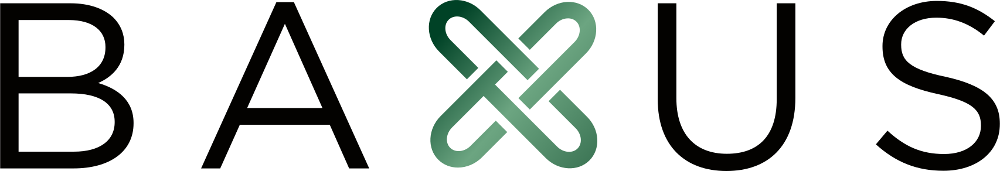
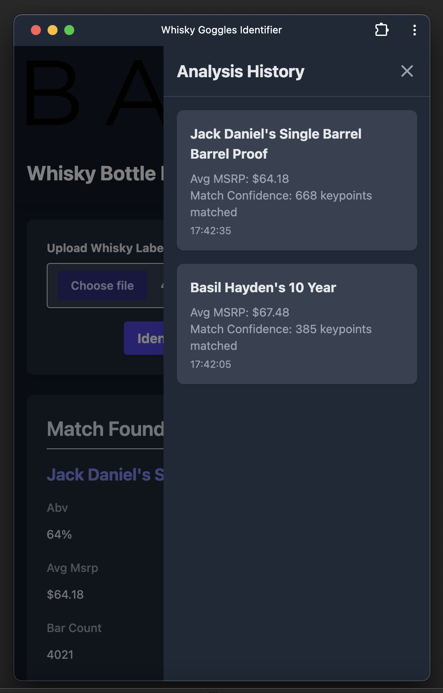
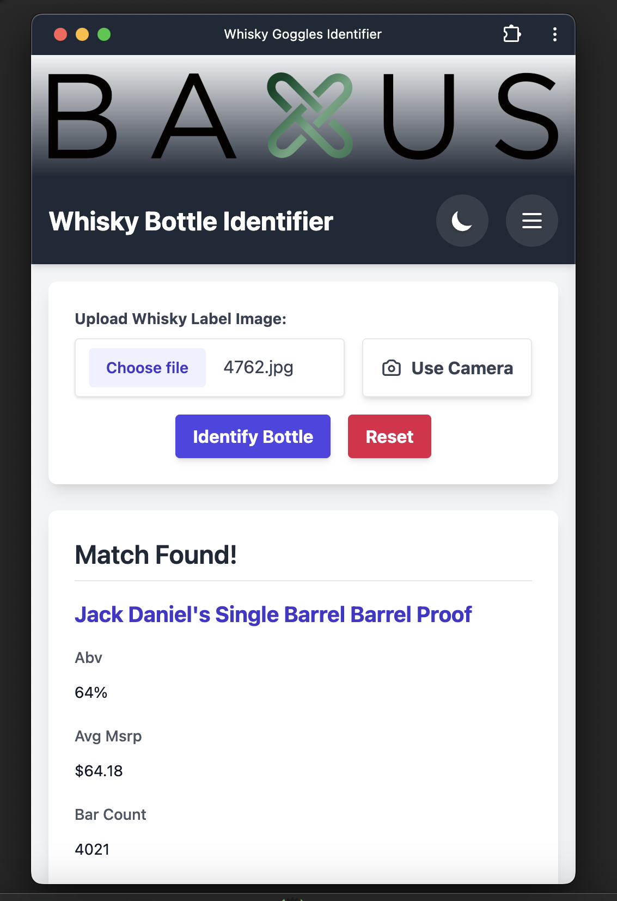

# BAXUS WHISKEY GOGGLES BY JED

- A live, hosted, ready-to-use version of this app is available 👉🏽
<a href="https://whisky-goggles-production.up.railway.app/" target="_blank" rel="noopener noreferrer">Whisky Goggles Live app</a>

- How it works: 
OCR

Read more here: <a href="https://gist.github.com/Jedway/4c0a8c7b0a5c4ea48a96996ed6792634" target="_blank" rel="noopener noreferrer">Whisky Goggles app full documentation</a>

### Demo and Walkthrough
- Watch the demo video of how the app works here:

## Prerequisites
- Python 3.8+
- Webcam (for real-time recognition)
- macOS/Linux/Windows

## Installation

1. Clone the repository (might take a bit of time because of project size/internet speed, please be patient 🙏🏽) :
```bash
git clone https://github.com/Jedway/whiskyGogglesApp.git
```

2. Enter the project directory
```bash
cd whiskyGogglesApp
```

3. Create and activate virtual environment:
```bash
python -m venv venv
source venv/bin/activate  
```
Or if you're on Windows:
```bash
python -m venv venv
source venv\Scripts\activate
```

4. Install required packages:
```bash
pip install -r requirements.txt
```

5. Run the dev server with:
```bash
python app.py
```

It will start up a server on port `5000`

6. Copy and paste this into your browser:
```bash
http://127.0.0.1:5000
```

### Minor quirks and features:
- The live hosted version of the app can be installed as a PWA for a somewhat native feel
- The app is intuitive to use. You can either upload an image or take a picture using your webcam or the rear camera of your mobile device.
- Dark/Light mode toggle to set the mood
- Hamburger menu features an "Analysis History" that lists all the scan results you've gotten for your session
- When using the camera mode on the live PWA on mobile, please take the picture in landscape so as to properly fit the bottle fully into frame
- Also, when using the camera mode on the live PWA, only press the "Take Photo" button once then press "X", as it captures and immediately starts analyzing on click

### Gallery
On mac as a PWA:
| Dark Mode      | Light Mode     |
|----------------|----------------|
|  |  |

On mobile as a PWA:
| Dark Mode      | Light Mode     |
|----------------|----------------|
|  |  |

### 👋🏽To the team at Baxus
Hi there, My name is Jed and I was very enthusiastic to work on this. I've made a roadmap of more features I intend to add and how far I'm willing to push this app so as to push the BAXUS brand and what it stands for even further. Check it out here: <a href="https://gist.github.com/Jedway/4c0a8c7b0a5c4ea48a96996ed6792634" target="_blank" rel="noopener noreferrer">Whisky Goggles app full documentation</a>


